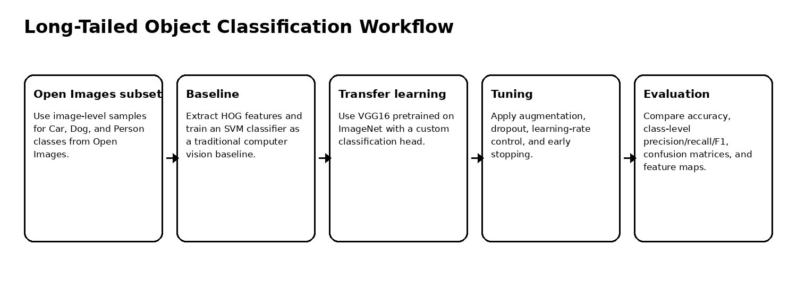
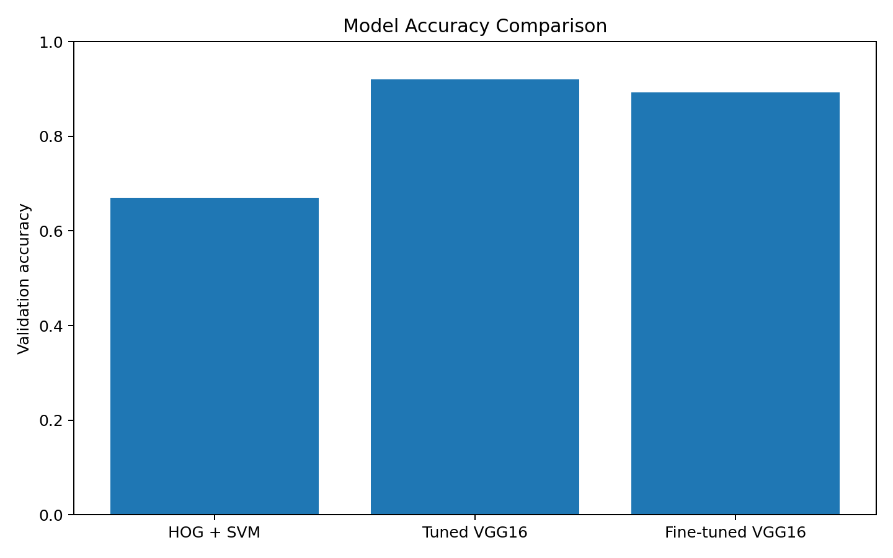
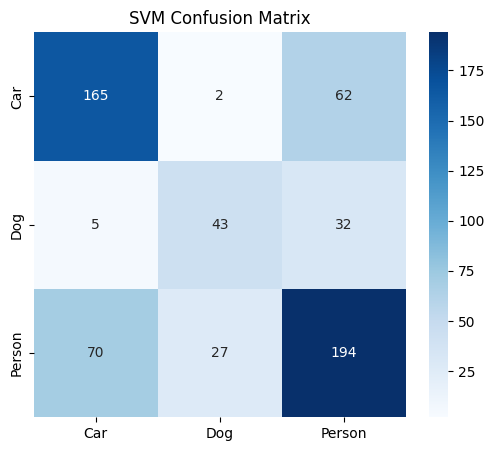
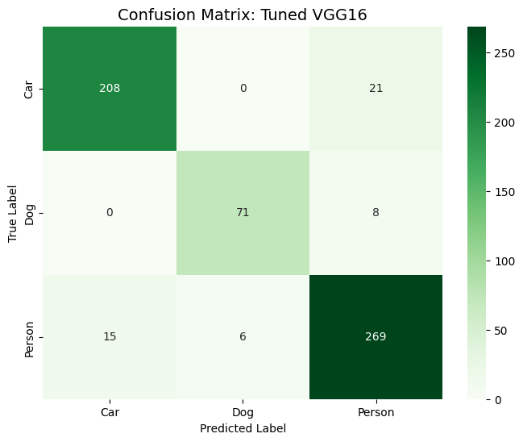
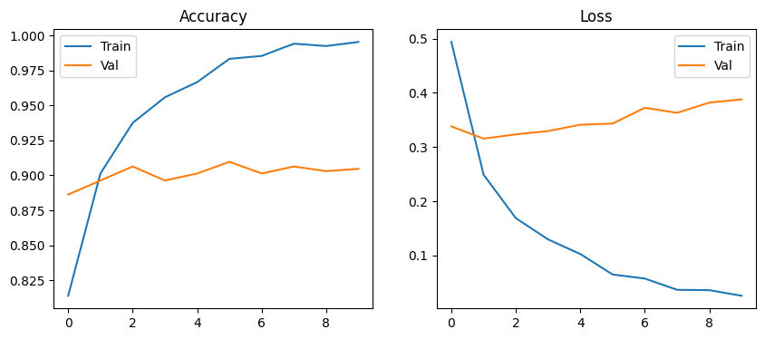
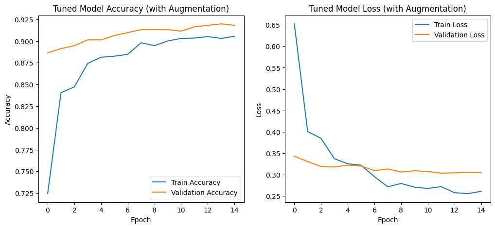
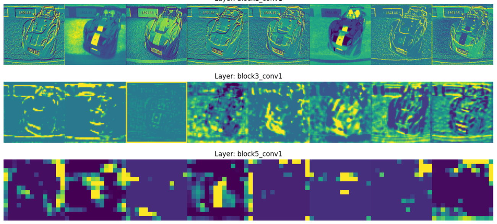

# Long-Tailed Object Classification with HOG+SVM and VGG16

Computer vision workflow for long-tailed object classification using Open Images data, HOG+SVM baseline, VGG16 transfer learning, augmentation, and fine-tuning.

## Overview

This project studies visual classification under a realistic class-distribution setting. It compares a traditional handcrafted-feature approach against modern transfer learning on a three-class image classification task: **Car**, **Dog**, and **Person**.

The project is motivated by long-tailed visual recognition, where real-world datasets often contain frequent head classes and fewer examples for tail classes. The notebook shows how transfer learning and augmentation can reduce the performance gap compared with a classical baseline.

## Dataset and Task

| Item | Details |
|---|---|
| Dataset family | Open Images |
| Classes | Car, Dog, Person |
| Task | Three-class image classification |
| Training images | 2,402 |
| Validation images | 598 |
| Challenge | Imbalanced, in-the-wild visual data with diverse backgrounds |

## Workflow



## Models

| Model | Approach | Role |
|---|---|---|
| HOG + SVM | Handcrafted feature extraction + linear classifier | Traditional baseline |
| VGG16 transfer learning | Pretrained CNN feature extractor + custom dense head | Deep learning baseline |
| Tuned VGG16 | Augmentation, dropout, learning-rate tuning | Main improved model |
| Fine-tuned VGG16 | Unfreezing block5 layers | Additional transfer-learning experiment |

## Results

| Model | Accuracy | Interpretation |
|---|---:|---|
| HOG + SVM | 67.00% | Struggled with complex real-world visual variation |
| Tuned VGG16 | 92.00% | Best overall result and strongest class balance |
| Fine-tuned VGG16 | 89.30% | Strong result, but did not exceed the tuned frozen-transfer setup |



## Class-Level Performance

The tuned VGG16 model reached strong class-level performance:

| Class | Precision | Recall | F1-score |
|---|---:|---:|---:|
| Car | 0.93 | 0.91 | 0.92 |
| Dog | 0.92 | 0.90 | 0.91 |
| Person | 0.90 | 0.93 | 0.91 |

## Visual Evaluation

| HOG + SVM confusion matrix | Tuned VGG16 confusion matrix |
|---|---|
|  |  |

| Baseline VGG16 curves | Tuned VGG16 curves |
|---|---|
|  |  |



## Key Findings

1. HOG + SVM provided a useful baseline but was not robust enough for complex in-the-wild images.
2. Transfer learning with VGG16 dramatically improved accuracy from 67% to about 92%.
3. Data augmentation and conservative learning-rate tuning helped control overfitting.
4. Fine-tuning deeper VGG16 layers achieved 89.3%, confirming the value of transfer learning but not outperforming the tuned frozen model.
5. Confusion matrices showed that the tuned model handled all three classes with balanced precision and recall.
6. Feature-map visualization helped reveal how convolutional layers respond to image patterns.

## Repository Contents

```text
.
├── long_tailed_object_classification_vgg16.ipynb
├── docs/
│   └── figures/
├── requirements.txt
├── .gitignore
└── README.md
```

## Run Locally

This repository is notebook-based. Create a clean Python environment, install the dependencies, then open the notebook.

### Windows PowerShell

```powershell
py -3.10 -m venv .venv
.\.venv\Scripts\Activate.ps1
python -m pip install --upgrade pip
pip install -r requirements.txt
```

### Linux / macOS

```bash
python3 -m venv .venv
source .venv/bin/activate
python -m pip install --upgrade pip
pip install -r requirements.txt
```


## Open the Notebook

```bash
jupyter notebook long_tailed_object_classification_vgg16.ipynb
```

## Notes

Raw image datasets are not included in the repository. The notebook downloads or prepares data during execution.
